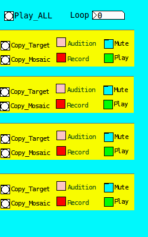

.. toctree::
   :maxdepth: 3

======================================
Overview
======================================

This software was written as part of a master thesis research undertaken at the MTG research group in Pompeu Fabra university in Barcelona. It uses their proprietary closed source analysis and audio matching software libraries which cannot be distributed with this software. My thesis is distributed under a creative commons licence and can be downloaded from `here <http://mtg.upf.edu/node/2332>`_   
If you do not have access to this software you will not be able to use the hierarchical framework described in my thesis.
Despite this, the software comprises a library of useful functions for building data-driven synthesis software and may prove useful to those getting started with pure data and/or python. 

Here is a `video <http://www.youtube.com/watch?v=0Q3SMwPAuKM>`_ demonstrating it's usage with the pure data client. 

======================================
Installation Instructions
======================================

***********************
Software Requirements
***********************

An easy way to install the python packages listed below is to use `pip <http://www.pip-installer.org/en/latest/installing.html>`_
There is no need to create a virtualenv. The below modules names (and version numbers) can then be pasted into 
a requirements file and installed in one go as described `in this page <http://www.pip-installer.org/en/latest/index.html#requirements-files>`_

--------------------------
Mandatory Software
--------------------------

 * `Python 2.6 <http://www.python.org/getit/releases/2.6.7/>`_
 * `pd-extended <http://puredata.info/community/projects/software/pd-extended>`_

 * `Essentia <http://mtg.upf.edu/technologies/essentia>`_
 * Gaia:

*Note:* You will need access to both the essentia and gaia source code. When compiling, the python wrappers for both libraries must also be installed.
When you compile the essentia source code a binary streaming_extractor will be created. For more information on this process and all the software requirements please see the documentation for essentia and gaia. 
You will need to copy the streaming_extractor, along with the entire svm_models directory which comes with the essentia source code into a directory configured in ``settings.py`` as described below so that hmosaic can run the audio analysis routines.

-----------------------------
Optional Software
-----------------------------

 * `rubberband <http://breakfastquay.com/rubberband/>`_ - Required for timestretching units to fit the target length (Recommended)

 * `aubio <http://aubio.org/download>`_ - Provides an alternative onset detection scheme to that of Essentia

 * `ffmpeg <http://ffmpeg.org/download.html>`_ (must be compiled with lame mp3 support) - required only for conversion of mp3 files to wav in ``hmosaic.scripts.convertAudio.execute_mp3_convert``.

-------------------------------
Mandatory Python Modules
-------------------------------

 * numpy==1.3.0 - http://numpy.scipy.org/
 * scikits.audiolab==0.11.0 - http://pypi.python.org/pypi/scikits.audiolab/
 * PyYAML==3.09 - http://pyyaml.org/download/pyyaml/
 * pyOSC==0.3.5b-5294 - http://pypi.python.org/pypi/pyOSC/0.3.5b-5294
 * SimpleOSC==0.3 - http://www.ixi-software.net/content/body_backyard_osc.html

*Note:* Before installing scikits.audiolab on linux you should make sure that you have the alsa dev libraries installed and also `libsndfile <http://www.mega-nerd.com/libsndfile/>`_  

 
-------------------------------
Optional Python Modules
-------------------------------

 * storm==0.15 - https://storm.canonical.com/
 * matplotlib==0.99.1.1 - http://matplotlib.sourceforge.net/users/installing.html
 * Sphinx==1.0.5 - http://sphinx.pocoo.org/

*Note:* Sphinx is required only in order to generate the documentation, the other modules are used by some of the experiment running and plotting examples in hmosaic.scripts.

  
*************************
Installing the Package
*************************

This software has only been tested on linux (ubuntu 10.04). As such, a dedicated cross platform installer is not provided.
In order for python to be able to find this package the installation directory ought to be added to your Python search path. The installation directory is whatever folder the source package was unzipped into. 
In order to see which directories are currently on the Python search path launch the Python interpreter and type the following::
    >>> import sys
    >>> sys.path

You will see a list of all the directories in which python looks for modules. 
An easy way to permanently add this package to that search path is to create a ``.pth`` file in the dist-packages directory. 
On my system this was in ::
    /usr/local/lib/python2.6/dist-packages

The ``.pth`` file can be called anything you like e.g. ``hmosaic.pth`` and it should contain the full filepath to the directory containing the top-level source code directory (``hmosaic``). 
In this way you run the code from a python interpreter irrespective of which directory you are in at the time.

*************************
Configuring the Package
*************************

The settings.py file is where the module ought to be configured. 
The following settings must be filled in::

    TARGET_REPO = '<path to directory to be used for segmenting and analysing targets>'
    SOURCE_REPO = '<path to directory containing source corpora>'
    ESSENTIA_BIN_DIR =  os.path.join(os.path.dirname(__file__), 'analyser')    

The last setting is a location for the essentia binary streaming extractor, along with the ``svm_models`` directory from the Essentia source code. By default, the system expects to find these in a folder called ``analyser`` in the same directory as the ``settings.py`` file, however they can be placed anaywhere and the full filepath supplied as the value for ``ESSENTIA_BIN_DIR``

Everything else is optional, check the settings.py file for more details. 
Each group of settings is commented.

****************************
Testing the Installation
****************************

Open a commandline terminal and navigate to the hmosaic directory. Execute the control process by typing::

    python control.py

If all is well you should see a message informing you that the ``Logging system is set up``

Launch pure data and open ``hmosaic/puredata/mainGUI.pd``

Check the connect box in the control panel and try selecting a corpus. You should see logging information 
confirming your corpus selection in the terminal window.

===========================================
Tour of the pure data mosaicing framework
===========================================
All of the pure data patches are contained in the ``puredata`` folder

* hl_main_gui.pd
* hl_control.pd
* hl_target.pd
* hl_mosaic.pd
* ll_descriptors.pd
* hl_similarity.pd
* corpus_control.pd
* ll_settings.pd
* hl_labels.pd
* hl_sequencer_buffer.pd
* hl_sequencer_row.pd

The main patch is ``hl_main_gui.pd`` - This patch loads all the other patches as sub-patches.
The following tour of the framework's functionality has been adapted from my `thesis <http://mtg.upf.edu/node/2332>`_

************************
Control GUI
************************

This gui abstraction conceals all the message sending logic for the gui framework. All framework applications send global messages here to be routed to the Python daemon via OSC. 
It also receives response messages from the Python daemon and routes them to the correct application.
This module contains a control for adjusting the volume of the target and the mosaic and a button to allow their chorusing, in order to hear how well the target and mosaic sound layered on top of each other.
There is also a button labelled ``Save Mosaic`` which saves, not only the mosaic, but the target, onset marked target and an informational text file containing the current state of the OSCControl object, all settings are written here. This functionality was included for research purposes, i.e. to be able to see which parameters created a particular effect.
Overall DSP audio control is also provided in this gui.

***********************
Corpus selection
***********************

Choose a corpus of source material with which to mosaic. A corpus can also be re-analysed, based on a specific segmentation scheme (e.g. ``'onsets'`` or ``500`` or ``1000``) derived from the global parameters set in the SegmentationGui. This is not recommended as it is **very slow**. New source corpora must be added manually to this module. 

************************
Segmentation
************************

.. image:: images/SegmenterGUI.png

With this patch one can test the segmentation of target and set global segmentation parameters.

The settings here are utilised, not only to perform the segmentation of the incoming target audio, but also to determine which segmentation scheme of the selected corpus will be (re)analysed if the user selects the ``Analyse`` option in the Corpus Gui.

The most important use of the segmenter is to preview the effects of different segmentation schemes on the target. In this respect it could be considered a mini application in its own right. The calculation of onsets using either aubio or essentia is supported, as is basic fixed length segmentation (which requires no analysis), and bpm based segmentation. 

The ``Mark Audio`` button takes the target, analyses it (according to the selected segmentation scheme) and marks the audio file with beeps where it will be cut. This allows the user to preview the accuracy of the selected segmentation scheme, adjust its parameters, preview the results and readjust or choose another segmentation scheme, etc. When the user is satisfied that the target has been marked correctly, the ``Reprocess Target`` button can be pressed in order to re-segment the target, according to the newly selected scheme.

The available segmentation schemes are described below:

------------------------------------
Aubio Note Segmentation
------------------------------------

In aubio mode, the command line utility `aubionotes <http://aubio.org/aubionotes.html>`_ is used and the ``minimum note length`` parameter is used to afford the user a measure of control over the granularity of the onsets, e.g. if they wish to count a very fast trill as just one note instead of many notes, the ``minimum note length`` parameter can enable them to achieve this. 

----------------------------------------
Essentia Onsets Segmentation
----------------------------------------

In essentia mode, the following descriptors are calculated for each frame of target audio:

Onset detection descriptors

+-----------------------------+-----------------------------------------------------------------------------+
| Name                        | Description                                                                 |
+=============================+=============================================================================+
|High Frequency Content (HFC) | Calculates the high frequency content of the spectrum as in [Masri]_        |
+-----------------------------+-----------------------------------------------------------------------------+
|Complex Domain               | Detects changes in both energy and phase for each frame of the signal       |
+-----------------------------+-----------------------------------------------------------------------------+
|Root Mean Square (RMS)       | Can be thought of as representing the energy in each frame                  |
+-----------------------------+-----------------------------------------------------------------------------+

Research has shown that combinations of HFC (good for percussive events) and Complex (good for reacting to more tonal onsets) perform better than an approach utilising only one or the other - Bello04. It is with this in mind, that we allow the user to pick any combination of these 3 features and a weighting for each feature selected. This is submitted to the OnsetDetection algorithm in essentia which picks the peaks and returns onset times.

----------------------------------
BPM based segmentation
----------------------------------

In this scheme, the target is first analysed, and the BPM is extracted.
From the BPM, it is trivial to calculate the ``beat`` length in milliseconds.
e.g. providing the BPM of the target is fairly constant, this method of segmentation approximates the pace of the original, so the mosaics sound more ``in sync`` with the target.

One problem with this approach is that the BPM beat length is rarely 500ms or 1000ms or 1250ms. This raises an issue where it may be difficult to find enough different onsets of the same length in the source corpus. The solution was to introduce a length tracking mechanism (as discussed in Settings, Transformations and Tracking below). Initially, the time stretching approach alone was employed, however the deterioration in quality of the audio can be very noticeable in places, especially if the stretch is large. For this reason, a second mode of length constraint satisfaction was devised which simply cuts the sound to make it shorter, or pads it with silence to make it longer. 

--------------------------------------
Fixed Length segmentation
--------------------------------------

This is the simplest scheme. The user picks between 500ms, 1000ms and 1250ms and the audio is segmented into equal size pieces. any left over samples are discarded.

*********************************
Similarity Search
*********************************

.. image:: images/NewSimilarityGUI.png

Select descriptors and corresponding weights to utilise when searching the source corpus for matching units.

When mosaicing, each of the target units is input into the similarity search module, in order to find the most similar units.
The similarity search gui, shown above is split across two panels. The high level similarity search is used to match high level chunks of audio of length greater than or equal to the chosen time resolution (5 seconds). The low level similarity search is then used to search for similar units within the pool of defined low level segments (which may be of a fixed length or variable length (based on onsets)).
This gui allows the user to select descriptors and weights. From each descriptor a euclidean distance measure is used to find the most similar units to it. The weights are then used to create a linear combination of euclidean distances, where the weight determines the importance attached to that particular descriptor when searching for similar units.
The high-level descriptor weighting is used to search for longer segments, while the low-level descriptor weighting is used to search through the smaller source units comprising each segment.

Similarity Search: Summary of Low level Descriptors
  
+----------------------------+----------------------------------------------------------------------------------------------------------+
| Descriptor                 | Summary                                                                                                  |
+============================+==========================================================================================================+
| Length                     | The duration of the audio                                                                                |
+----------------------------+----------------------------------------------------------------------------------------------------------+
| Spectral Flatness          | An indication of percussivity in the Spectrum  [Peeters]_                                                |
+----------------------------+----------------------------------------------------------------------------------------------------------+ 
| Spectral RMS               | The root mean square of the signal calculated in the frequency domain.                                   |
+----------------------------+----------------------------------------------------------------------------------------------------------+
| Spectral Centroid          | The barycenter of the spectrum  [Peeters]_                                                               |
+----------------------------+----------------------------------------------------------------------------------------------------------+
| Spectral Spread            | The spread of the spectrum around the centroid  [Peeters]_                                               |
+----------------------------+----------------------------------------------------------------------------------------------------------+
| Spectral Decrease          | Similar to Spectral Rolloff as described in [Peeters]_                                                   |
+----------------------------+----------------------------------------------------------------------------------------------------------+
| Spectral Flux              | A measure of the overall, frame by frame, change in magnitude of the frequency bins [Dixon]_             |
+----------------------------+----------------------------------------------------------------------------------------------------------+
| Spectral Energy            | Another measure of the energy of the signal calculated in the frequency domain.                          |
+----------------------------+----------------------------------------------------------------------------------------------------------+
| Zero Crossing Rate         | A measure of how often the signal crosses the zero axis [Peeters]_                                       |
+----------------------------+----------------------------------------------------------------------------------------------------------+
| Pitch                      | An estimation of the fundamental frequency of the spectrum                                               |
+----------------------------+----------------------------------------------------------------------------------------------------------+
| Spectral Contrast          | A modified version [Akkermans]_ of the Octave Based Spectral Contrast feature described in [Lu]_         |
+----------------------------+----------------------------------------------------------------------------------------------------------+
| HPCP                       | The tone chroma of the audio signal as described in [Gomez]_                                             |
+----------------------------+----------------------------------------------------------------------------------------------------------+
| MFCC                       | Calculates the coefficients of the mel-frequency cepstrum(MFCC-FB40 implementation) [Ganchev]_           |
+----------------------------+----------------------------------------------------------------------------------------------------------+
| Barkbands                  | Divides the frequency range into perceptually derived bands and calculates the energy for each.          |
+----------------------------+----------------------------------------------------------------------------------------------------------+

All of the high level descriptors mentioned involve the use of libsvm, which precludes their realtime calculation.

For more information on how these descriptors are calculated, the interested reader is referred to Wack2010} or \cite{Laurier2009} for more specific details on the mood descriptors.

Similarity Search: Summary of High level descriptors
  
+----------------+--------------------------------------------------------------------------------------------+
| Descriptor     | Summary                                                                                    |
+================+============================================================================================+
| Happiness      | A single value describing the happiness of the analysed music [Laurier]_                   |
+----------------+--------------------------------------------------------------------------------------------+
| Sadness        | A single value describing the sadness of the analysed music  [Laurier]_                    |
+----------------+--------------------------------------------------------------------------------------------+
| Relaxedness    | A single value describing the relaxedness of the analysed music [Laurier]_                 |
+----------------+--------------------------------------------------------------------------------------------+
| Aggressiveness | A single value describing the aggressiveness of the analysed music [Laurier]_              |
+----------------+--------------------------------------------------------------------------------------------+
| Male           | A single value describing the probability of the male gender in the audio [Wack]_          |
+----------------+--------------------------------------------------------------------------------------------+
| Female         | A single value describing the probability of the female gender in the audio [Wack]_        |
+----------------+--------------------------------------------------------------------------------------------+
| Instrumental   | A single value describing the probability that the audio is instrumental [Bogdanov]_       |
+----------------+--------------------------------------------------------------------------------------------+
| Vocal          | A single value describing the probability that the audio is vocal [Bogdanov]_              |
+----------------+--------------------------------------------------------------------------------------------+

******************************************
Settings, Transformations and Tracking
******************************************

.. image:: images/NewSettings.png
 
Track certain properties of the target and implement global settings affecting unit search 
and unit selection.

This gui is split into two sections

1. Target Tracking
2. Settings

----------------------------
Target Tracking
----------------------------

Three different target tracking mechanisms have been implemented:

``Key`` is another semantic descriptor, the idea is to choose units in the same key as the target and keep the whole thing semantically linked. As ``key`` is a label (i.e. F\#, A, etc.), the problem of not having enough source units to find one matching the target key must   be contended with. Similarly there may be too few source units of a particular key, such that units get repeatedly selected, which can sound jarring.
These selection problems are not as pronounced as for ``scale`` where the target unit will have one or two values - major or minor. This is a much broader classification than ``key``, where many different values are available.
Both ``key`` and ``scale`` thresholds apply only during the high level unit selection process.

The ``track length`` feature stemmed from repeated use of the length descriptor as the highest weighted feature in similarity search during testing. It was felt that the unit length was so important for maintaining some kind of temporal/rhythmic identity with the target, that it should be treated separately. Using the ``track length`` feature affixes the source unit to a grid based on the target's bpm.
 
Depending on the selected mode, units which do not exactly fit, will be either time-stretched or padded with silence or simply cut.
The time-stretching functionality is provided by the `rubberband <http://breakfastquay.com/rubberband/>`_ commandline utility.  
which is an open-source phase vocoder implementation providing time-stretching and pitch-shifting.

------------------------
Settings
------------------------

The settings application is where control over the concatenation algorithm is proffered. The user can toggle high level mosaicing on or off and also choose a crossfade time in milliseconds for overlapping the units and eliminating concatenation artefacts caused by sudden changes in energy and/or phase between adjacent units in the mosaic. High level scope indicates how many of the closest matching source segments are included in order to generate the pool of available units for the low level search process. Low level scope indicates how many low level unit search results are returned. This could have an impact if the results are processed by either or both of the two cost functions which may reorder the results. Both cost functions can be activated/deactivated from this settings module.
``Unit Context`` is a cost based on how similar each low level result is to the other low level results (based on the low level search parameters).
``Repeat Cost`` is a cost which penalises those units which are repeatedly selected. It can be useful in situations where the same unit is getting repeatedly selected to the extent that the mosaic sounds like a broken record.

**********************************
Mosaic Looper
**********************************

This mini-application is used to build mosaic-augmented loops

This patch was an extension of the framework, made in order to experiment with composition and music-making with mosaics.  
The inspiration was the `Loopmash <http://www.steinberg.net/en/products/apps_sounds_accessories/loopmash.html>`_ project where the user can create layers of mosaics in a loop playing in real time. 
The pure data 4 track looper shown above is a crude imitation, but with the chosen targets pre-segmented and pre-analysed it proved to be quite a lot of fun to use.

It allows the user to control:

 * 3 mosaics playing in real time with the target
 * Mosaics can be muted and unmuted in real time and can also be played individually.
 * New mosaics can be processed in the background and copied to the looper when ready or auditioned to see how they fit with the rest of the audio.
 * Using the 'Record' function a portion of the mosaic can be copied into a buffer whilst looping audio.

Like Loopmash it worked well with drumloops, it is possible to augment them, creating heavy syncopated beats, reminiscent of dubstep or wonky hiphop, etc.

An example video of the looper in action can be seen `here <http://www.youtube.com/watch?v=0Q3SMwPAuKM>`_

The current implementation is just a proof of concept, and there are glitches in the audio when loading new mosaics from disk or using the record function (as can be heard in the video). These errors would have to be resolved in order to make this looper a useful tool, however the promise of this paradigm is evident, not only for composition but even for live performance.
Unfortunately, the hierarchical model did not allow the same level of spontaneity and fun as the analysis takes too long. 

******************************
References
******************************

.. [Masri] 
P. Masri and A. Bateman, Improved Modelling of Attack Transients in Music Analysis-Resynthesis, proceedings of International Computer Music Conference (ICMC), (Hong Kong), pp. 100-103, 1996.

.. [Peeters] 
G. Peeters, A large set of audio features for sound description (similarity and classification) in the CUIDADO project, tech. rep., IRCAM, 2004.

.. [Dixon] 
Simon Dixon, Onset Detection Revisited, In Proc. of the Int. Conf. on Digital Audio Effects (DAFx-06), pp. 1-6, 2006.

.. [Akkermans] 
V. Akkermans, J. Serrà, and P. Herrera, Shape-based Spectral Contrast, proceedings of the SMC 2009 - 6th Sound and Music Computing Conference, no. July, (Porto), pp. 23-25, 2009.

.. [Lu] 
L. Lu, H.-j. Zhang, J.-h. Tao, and L.-h. Cui, Music type classification by spectral contrast feature, Proceedings. IEEE International Conference on Multimedia, pp. 113-116, Ieee, 2002.

.. [Gomez] 
E. Gomez,Tonal Description of Music Audio Signals. PhD thesis, Universitat Pompeu Fabra, 2006.

.. [Ganchev] 
T. Ganchev, N. Fakotakis, and G. Kokkinakis, Comparative Evaluation of Various MFCC Implementations on the Speaker Verification Task, in proceedings of the 10th International Conference on Speech and Computers, vol. 1, (Patras, Greece), pp. 191-194, 2005.

.. [Laurier] 
C. Laurier, O. Meyers, J. Serra, M. Blech, and P. Herrera, Music Mood Annotater Design and Integration, 2009 Seventh International Workshop on Content-Based Multimedia Indexing, pp. 156-161, June 2009.

.. [Wack] 
N. Wack, C. Laurier, O. Meyers, R. Marxer, D. Bogdanov, J. Serrà, E. Gómez, and P. Herrera, Music classification using high-level models, tech. rep., Universitat Pompeu Fabra, 2010.

.. [Bogdanov] 
D. Bogdanov, J. Serrà, N. Wack, and P. Herrera, Semantic Similarity Measure For Music Recommendation (A Pharos whitepaper). 2009.

======================================
API documentation
======================================

Each module is documented seperately below:

*****************
__init__.py
*****************

All information is logged to a central file, whose docstring is shown below:

.. automodule:: hmosaic.__init__

*****************
settings.py
*****************

Global application settings are maintained centrally in the *settings* module

.. automodule:: hmosaic.settings
   :members:

*****************
control.py
*****************

The main module in the package, it contains a class called OSCControl. 
This process builds mosaics from the source audio, controls segmentation schemes, source corpus selection, etc.

Full details are displayed in the code documentation below:
 
.. automodule:: hmosaic.control
   :members:

***************
corpus.py
***************

This module contains classes for managing audio files and analysis.
An extensible base class is provided so that the software may be extended with
different file management schemes and methodologies.
The provided *FileCorpus* implementation also provides methods for segmenting source audio
and for returning Gaia DataSets populated by analysis of parts of the source corpus.

Full documentation  follows below:

.. automodule:: hmosaic.corpus
   :members:

*****************
analyse.py
*****************

Provides an analyser for interfacing with different precompiled essentia,
streaming extractor binaries. 

.. automodule:: hmosaic.analyse
   :members:

*****************
segment.py
*****************

Provides classes for segmenting the audio in different schemes.
One uses a fixed unit size, the other uses onsets derived from analysis using 
Essentia or Aubio.

.. automodule:: hmosaic.segment
   :members:

****************
models.py
****************

Provides high level representations of Mosaics, MosaicUnits, Audio, etc.

.. automodule:: hmosaic.models
   :members:

******************
utils.py
******************

Any code which gets used more than once is refactored into a function and 
stored in here. We have mainly audio/signal processing, string processing and
filesystem oriented functions.

.. automodule:: hmosaic.utils
   :members:

======================================
Scripts documentation
======================================

******************
createCorpus.py
******************

This script accepts a filepath or directory name as parameter and creates a source corpus from
all the audio it finds there.

.. automodule:: hmosaic.scripts.createCorpus
   :members:

**************************
createHighLevelChops.py
**************************

This module contains functions for testing hierarchical mosaicing processes.

.. automodule:: hmosaic.scripts.createHighLevelChops
   :members:

**********************
processTestData.py
**********************

This module contains examples of functions to run experiments and gather data using 
the framework.

.. automodule:: hmosaic.scripts.processTestData
   :members:

******************
plotResults.py
******************

This module contains examples of functions to plot experimental results using matplotlib.

.. automodule:: hmosaic.scripts.plotResults
   :members:

===========================
LICENCE
===========================

This software is copyright of John O'Connell, 2011.
It is released under the GNU General Public licence: http://www.gnu.org/copyleft/gpl.html
A copy of this licence is included in the ``COPYING`` file.

